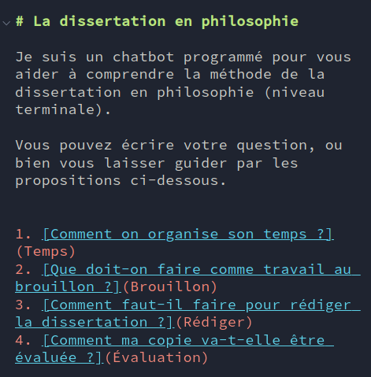
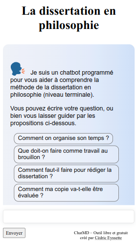
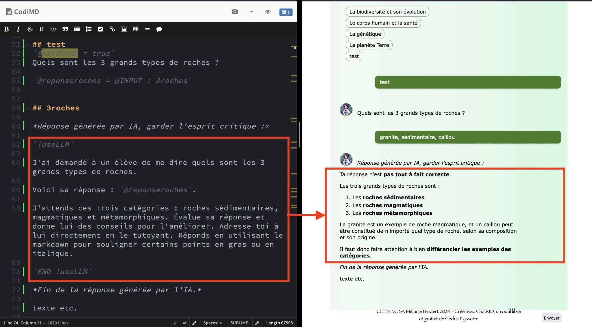
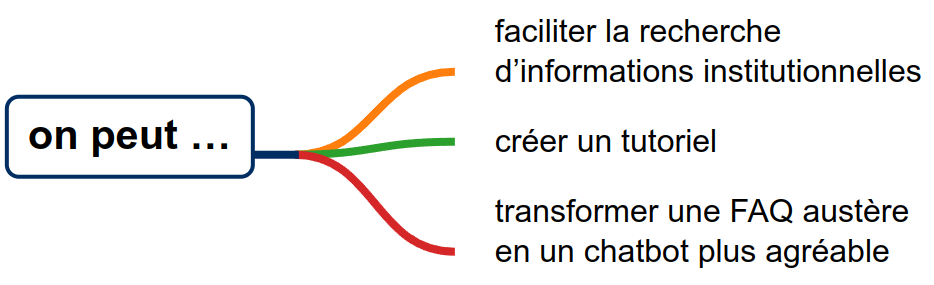
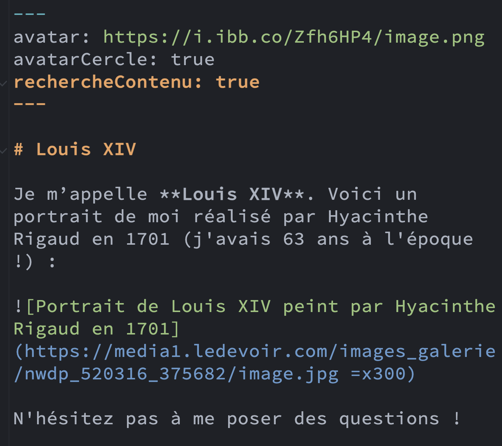

<!-- _class: invert -->

# 🗣️ ChatMD, un outil libre et gratuit  pour créer un chatbot <!-- fit -->

Cédric Eyssette
Chargé de projet DRANE Lyon
https://chatmd.forge.apps.education.fr/

---
<!-- _class: invert -->
## I –  Présentation  générale <!-- fit -->

---
<!-- _class:  -->

## Contexte

📈 **Avec l'IA** : renouveau de l'intérêt pour les chatbots
💬 **Interaction** plus fluide et intuitive
⚡ Accès **immédiat**, disponibilité **continue**

Mais
🤯 Risque d'**“hallucinations”** et de **biais**
⚖️ **Problématiques** économiques, juridiques, sociales, morales et écologiques

---
<!-- _class:  -->

## La solution [ChatMD](https://chatmd.forge.apps.education.fr)

🔨 Un logiciel en ligne, **libre et gratuit**, hébergé sur la  **ForgeEdu**

👩‍⚖️ Pas besoin de compte, pas de collecte de données &rArr; **compatible  RGPD**

✨ **Création simplifiée** d'un chatbot, à partir d'un fichier texte en Markdown

---
<!-- _class:  -->

---
<!-- _class:  -->

## ChatMD et l'IA générative <!-- fit -->

⚙️ Algorithme principal **sans IA**

🎯 Connexion à une IA de manière **sobre et ciblée**

<!-- 
Décomposition en tokens pondérés
Calcul de similarité cosinus
Prise en compte de la distance de Levenshtein
-->

---
<!-- _class:  -->

---
<!-- _class: invert -->
## II –  Usages  possibles<!-- fit -->

---
<!-- _class:  -->

## Usages possibles d’un point de vue institutionnel, ou dans le cadre d’une formation

<aside>

[1/Assistance](https://chatmd.forge.apps.education.fr/#https://codimd.apps.education.fr/KgiRUrr8Ttq9-CxZGmxmmg), [2/IGN](https://ignf-ma-carte.github.io/chatbot/)
[3/ Accessibilité](https://chatmd.forge.apps.education.fr/#https://horvathjulie.forge.apps.education.fr/bot/comprehension.md)
</aside>

---
<!-- _class:  -->

## Usages possibles dans un cadre pédagogique

<aside>

[1/Philosophie](https://chatmd.forge.apps.education.fr/#dissertation-philo), 
[2/ Microscope](https://chatmd.forge.apps.education.fr/#https://codimd.apps.education.fr/xGNHIJSeTVCk6FHas-_71g)
[3/Maths](https://chatmd.forge.apps.education.fr/#https://codimd.apps.education.fr/89_9jQXNRga1mbGgXOUuJw)
[4/ Orientation](https://chatmd.forge.apps.education.fr/#https://codimd.apps.education.fr/UB1xium-TSqpdHEqdxipTw)
[5/ Sartre](https://chatmd.forge.apps.education.fr/#https://codimd.apps.education.fr/39v880G4Siu9Xw93UOTF0g)
</aside>

---
<!-- _class: invert -->
## III –  Fonctionnalités  avancées<!-- fit -->

---
<!-- _class: -->

On utilise un _en-tête YAML_ pour ajouter certaines fonctionnalités plus avancées

---
<!-- _class:  -->

Ou alors on utilise une syntaxe particulière

---
<!-- _class:  -->

## Gestion de l'affichage et du contenu <!-- fit -->

**Avec ChatMD, on peut :**

* Personnaliser l’apparence de son chatbot : avatar, styles CSS, activation/désactivation du clavier
* Détecter automatiquement les gros mots et des insultes
* Gérer des contenus particuliers : formules mathématiques, blocs encadrés, sons, schémas et graphiques, iframes
* Gérer un chatbot plus important : variables, source répartie entre plusieurs fichiers, structuration du document

---
<!-- _class:  -->

## Interactions avec l'utilisateur plus avancées <!-- fit -->

**Avec ChatMD, on peut :**

* Affiner l'algorithme de sélection de la réponse la plus pertinente : mots clés, mots clés négatifs …
* Faire un quiz pour poser des questions et vérifier la réponse de l’utilisateur
* Introduire de l'aléatoire dans les réponses ou dans les questions du chatbot
* Utiliser des variables dynamiques et du conditionnement en fonction de ces variables 
* Avoir plusieurs bots qui répondent

---
<!-- _class:  -->

## Utilisation d'une IA générative <!-- fit -->

**Avec ChatMD, on peut :**

* Connecter son chatbot à une IA générative (sur internet ou en local) 
* Faire du RAG de manière simplifiée en indiquant les sources d'informations, qui seront utilisées par le LLM pour produire sa réponse.

On peut aussi utiliser une IAG pour produire un chatbot avec la syntaxe de ChatMD

---
<!-- _class: invert -->
## IV –  Création d'un  chatbot !<!-- fit -->

---
<!-- _class:  -->

### Prérequis

1) Connexion au portail Apps Éducation
2) Connexion à CodiMD

---
<!-- _class:  -->

### Proposition

**Objectif :** créer un chatbot pour accompagner les élèves dans la compréhension de la méthode ou d'un point de cours particulier

* **1er niveau** : mettre en place la structure de base
* **2e niveau** : personnaliser l'affichage et mettre en forme le contenu
* **3e niveau** : questionner les élèves et évaluer leurs réponses

<!--
se rappeler
=> se tester, se questionner

** Gestion contenus particuliers :
insertion image avec Codi
encadrés
maths: true

Personnalisation :
clavier: false
avatar
avatarCercle: true
footer

** Utiliser ChatMD pour évaluer :
- Clic sur un bouton :
1) [intitulé]​(lien) au lieu de 1. [intitulé]​(lien)
obfuscate: true
utiliser ---
ou une variable
- Réponse simple (détection de mots clés):
!​Next: Titreréponse
- Evaluation par un LLM
-->