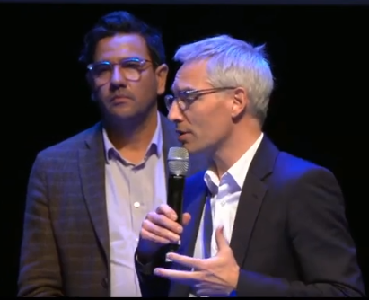
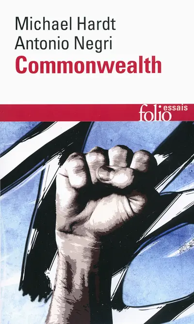
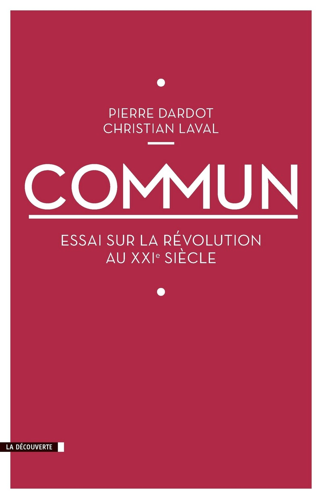
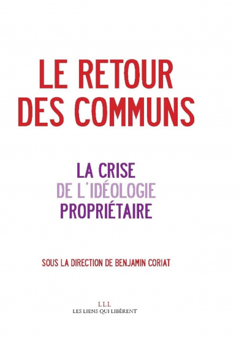

<!-- _class: titre -->

# Les communs  numériques éducatifs  Repères historiques & conceptuels<!-- fit -->

Cédric Eyssette / Drane Lyon
2024-2025

---
<!-- _class: pp citationC  -->

> « Fondamentalement, il y a un partage de valeurs entre la mission d’éducation et les communs numériques qui est absolu. »
>> Audran **Le Baron**, directeur du numérique pour l'éducation, _Plénière d'ouverture de Numérique en Commun[s] 2024_ (25 septembre 2024)

<!-- 
Une tendance actuelle importante
Plus généralement : retour en force de la notion de "communs"
-->

<!-- TODO: ajouter le lien vers la vidéo -->

---
<!-- _class:  -->

### Pour comprendre les enjeux <!-- fit -->

Les communs numériques éducatifs
&darr;
Les communs numériques
&darr;
Les commmuns

---
<!-- _class: pp -->

2012

2014

2015

<!-- 
Hardt, Negri : 2012
Dardot, Laval : 2014
Benjamin Coriat : 2015-->

<!-- TODO : ajouter les liens vers une revue de chaque livre -->

---
<!-- _class: pp -->

Elinor Olstrom, _Governing the Commons_ (1990)

Naomi Klein, “Reclaiming the commons” (2001)

<!-- 
théorie : Elinor Olstrom () Prix Nobel Economie en 2009 : Governing the Commons (1990)
pratique/politique : Naomi Klein, "Reclaiming the commons" (2001)
-->

---
<!-- _class:  -->

### Pour comprendre les enjeux <!-- fit -->

Le bien commun
&darr;
Les biens communs
&darr;
Les communs

---
<!-- _class: partie -->
# I –  Du bien commun  aux communs <!-- fit -->
Première partie

---
<!-- _class: souspartie -->
## A.  Le bien commun

---
<!-- _class: souspartie -->
## B.  Les biens communs <!-- fit -->

---
<!-- _class: souspartie -->
## C.  Les communs

---
<!-- _class: partie -->
# II – Des communs  aux communs  numériques éducatifs <!-- fit -->
Deuxième partie

---
<!-- _class: souspartie -->
## A.  Les communs numériques <!-- fit -->

---
<!-- _class: souspartie -->
## B.  Les communs  numériques éducatifs<!-- fit -->