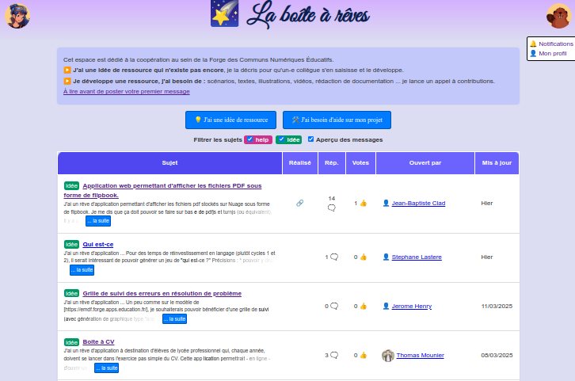

<!-- _class: titre-->

# La Forge des  communs  numériques  éducatifs<!-- fit -->

Drane Site de Lyon – Formation IAN
13 mars 2025

---

<!-- _class: pp  -->

|||
|:-:|:-|
||- Je ne sais pas ce que c'est ! - Je n'ai pas envie ou ça me semble trop compliqué - Je suis sceptique, voire très critique|
||- Je veux bien tester, voire j'ai testé - Je ne vois pas bien ce que ça peut m'apporter dans ma pratique|
||- J'ai testé et j'ai repéré des usages intéressants - Je souhaite les intégrer dans ma pratique, voire je l'ai déjà fait|

---
<!-- _class: i1t1 horizontal  -->

Un projet initié en 2022 par **Alexis Kauffmann**, chef de projet logiciels et ressources éducatives libres à la _Direction du Numérique pour l'Éducation_ (DNE)

---
<!-- _class: fppppppppp -->

LaForgeÉdu s'inscrit dans la **dynamique des communs numériques**.

1) Des ressources partagées
2) Une communauté
3) Une gouvernance partagée

---
<!-- _class: fpppppp -->
### Des valeurs inhérentes à LaForgeÉdu :<!-- fit -->

1) Développement du libre éducatif et des communs numériques
2) Valorisation des pratiques collaboratives : « l'union fait la forge ! »
3) Montée en compétences numériques pour tous les collègues et soutien institutionnel pour les projets sur la Forge

---
<!-- _class: -->

## I - Qu'est-ce  qu'une forge ?  À quoi ça sert ? <!-- fit -->

---
<!-- _class:  -->
Une forge ressemble à première vue à un **espace de  stockage en ligne** de fichiers que l'on peut synchroniser avec son propre ordinateur pour garantir la pérennité des données.

* Quelle est la différence avec NextCloud ?

---
<!-- _class: pp -->

###  A. Un outil conçu  au départ pour le  développement logiciel<!-- fit -->

… qu'on va pouvoir détourner pour en faire un outil pour tout le monde (ou presque…) !

---
<!-- _class:  -->
Une forge vise au départ à **héberger du code informatique**.

Elle n'est **pas faite pour héberger des fichiers lourds** (vidéo, audio, …) : on y trouve surtout des fichiers au format texte.

Une forge propose **un ensemble d'outils** pour répondre aux besoins des personnes qui **développent un logiciel**.

<!-- Pas faite pour héberger des fichiers lourds :
exceptions possibles
Git LFS -->

---
<!-- _class: fmmmmmmmm -->

#### Pour développer un logiciel, on a besoin de :
1) pouvoir organiser et répartir les tâches à faire grâce à des outils de **gestion de projet**
1) pouvoir **éditer facilement** le code pour créer de nouvelles fonctionnalités ou corriger des bugs, avec la possibilité d'**expérimenter** sans risques
1) pouvoir **travailler collectivement** sur le même code, avec la possibilité de **discuter** des modifications proposées et de les **intégrer** facilement
1) pouvoir conserver un **historique des modifications** et **revenir en arrière** en cas de problème
1) pouvoir lancer **automatiquement** des **scripts** qui vont **tester** / vérifier le code ou le **compiler**
1) pouvoir facilement **déployer sur le web** son logiciel
1) pouvoir créer de la **documentation** facilement
1) pouvoir récupérer le **feedback des utilisateurs** (“_issues_”) et **collaborer** avec d'autres développeurs pour corriger les bugs et ajouter des fonctionnalités

<!-- évoquer : méthode agile / DevOps -->

---
La _Forge des Communs Numériques Éducatifs_ est une forge fondée sur un logiciel libre : Gitlab, qui propose tous ces outils.

La connexion se fait via le portail Apps Education (possibilité de comptes externes).

Les projets que l'on crée peuvent être publics ou privés.

---
<!-- _class: pp -->

###  B. Un outil qu'on peut  détourner et qui peut  servir à tout le monde<!-- fit -->

---
<!-- _class: pp i1t0 -->

---
<!-- _class:  -->

## II - Première  entrée concrète  dans la Forge <!-- fit -->

---
<!-- _class: pp fpppppp-->

###  A. Explorer les logiciels et  ressources de la Forge <!-- fit -->

Niveau 1

---
<!-- _class: fm -->

1) Utiliser la cartographie
	- https://docs.forge.apps.education.fr/cartographie/
2) Utiliser un portail spécifique : 
	- https://primaire.forge.apps.education.fr/
	- https://marklab.forge.apps.education.fr/
3) Utiliser l'explorateur Gitlab
	- https://forge.apps.education.fr/explore/projects

<!-- 
Montrer les éléments clés d'un projet :
descriptif, README, licence …
-->

---
<!-- _class: i1t1 pp-->

### La boîte à rêves

---
<!-- _class: pp -->

###  B. S'inscrire dans  la communauté   de la Forge <!-- fit -->

Niveau 2

---
<!-- _class: f -->

1) S'inscrire sur la plateforme
	- https://docs.forge.apps.education.fr/
2) S'inscrire dans les groupes Tchap de la communauté de la forge
	- Salon principal : [LaForgeÉdu](https://tchap.gouv.fr/#/room/!fnVhKrpqraWfsSirBK:agent.education.tchap.gouv.fr?via=agent.education.tchap.gouv.fr&via=agent.collectivites.tchap.gouv.fr)
	- [TEST LaForgeÉdu](https://tchap.gouv.fr/#/room/!FMbqDmwePWphQDroBV:agent.education.tchap.gouv.fr?via=agent.education.tchap.gouv.fr&via=agent.diplomatie.tchap.gouv.fr&via=agent.dinum.tchap.gouv.fr)
	- [DEV LaForgeÉdu](https://tchap.gouv.fr/#/room/!BXZZsyWklktciNEDbM:agent.education.tchap.gouv.fr?via=agent.education.tchap.gouv.fr)
	- [IA LaForgeÉdu](https://tchap.gouv.fr/#/room/!IpZpqVTFcNrhUNUAJc:agent.education.tchap.gouv.fr?via=agent.education.tchap.gouv.fr)
3) Créer un ticket pour faire un rapport de bug ou une suggestion d’amélioration pour un projet
	- [Bac à sable](https://forge.apps.education.fr/drane-lyon/ian/sandbox/test)

<!-- 
Montrer un exemple de projet avec des tickets traités pour faire évoluer l'application
-->

---
<!-- _class:  -->

## II - Créer et participer  à un projet collaboratif <!-- fit -->

---
<!-- _class: fpppppppp -->

1) Choix du projet et répartition dans les groupes de travail : [s'inscrire dans ce pad](https://lightpad.forge.apps.education.fr/#https://codimd.apps.education.fr/kMUkZK9HTIyhzj_mrR_TYA)
2) Utilisation de l'éditeur en ligne (WebIDE) pour faire des modifications
3) Organisation du travail collaboratif sur la Forge