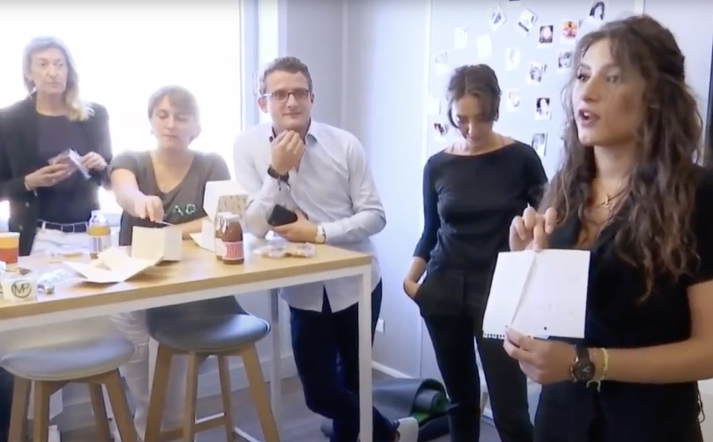

<!-- _class: titre -->

# Q1a – Peut-on savoir ce qu'est le bonheur ?
Cédric Eyssette (2024-2025)
https://eyssette.forge.apps.education.fr/

---
<!-- _class: i1t0 pp -->

<!-- 
À faire noter :
Situation initiale : un nouveau métier “Chief Happiness Officer” (Responsable du bonheur en entreprise) -->

<!-- 
Autre possibilité : commencer par les mesures du bonheur
ou : la psychologie positive
 -->

---
<!-- _class: i1t1 horizontal fppp -->

1) Que pensez-vous de ce métier ? Est-ce bien qu'il y ait une personne responsable du bonheur dans une entreprise ?
2) De manière générale, peut-on dire aux autres ce qu'ils doivent faire pour être heureux ?

<!-- Si aucun élève ne voit de problème possible dans ce type de métier : montrer l'extrait de la Mise à mort du travail (/ Carglass)
https://drive.google.com/file/d/1droEUxvFSiNfFPgkV3190JXhBcVEuHWM/view?usp=sharing	
 -->

---
<!-- _class: definition fpppppp-->

#### :large_blue_circle:  Définitions

* Une **conception normative du bonheur** prétend qu'il y a une règle à suivre afin de parvenir au bonheur.
* Le **paternalisme** consiste à imposer ou à faire un choix à la place d'une personne en prétendant savoir ce qui est bien pour elle.

<!-- Peut-on défendre une conception normative du bonheur ?
Le paternalisme est-il justifié ? -->

---
<!-- _class: partie -->
# I – Critique des “recettes du bonheur” 
PREMIÈRE PARTIE

---
<!-- _class: citationC -->

>« Le bonheur est un idéal, non de la raison, mais de l’imagination ».
>>**Kant**, _Fondements de la Métaphysique des Mœurs_, 2e section

---
<!-- _class: fmm pp -->

#### :large_blue_circle:  La conception que j'ai du bonheur :

|elle n'est pas …|mais elle est …|
|:-:|:-:|
|universelle  (valable pour tous)|particulière  (relative à l'individu)|
|objective|subjective <aside id="aside1">&rArr; le paternalisme  n'est pas justifié !</aside>|
|un concept  parfaitement défini,  logique et cohérent|une image  vague  et confuse|
|une méthode infaillible  qui me garantit  nécessairement  d'être heureux|un simple espoir  qui peut m'exposer  à une déception  profonde<aside id="aside2">&rArr; même moi,  je ne peux pas  prétendre savoir  ce qu'est le bonheur   avec certitude</aside>|

---
<!-- _class: i1t1 horizontal pp  -->

>« Au milieu des années 1950, April et Frank Wheeler forment un jeune couple américain qui, en apparence, a tout pour être heureux (enfants, maison, travail...) […] ils finissent par devenir tout ce qu'ils ne voulaient pas être : un homme coincé par son métier […] et une femme au foyer morose rêvant d'une autre vie. » ([source](https://fr.wikipedia.org/wiki/Les_Noces_rebelles)).

---
<!-- _class: i2t0 pp contain -->

---
<!-- _class: pm  -->

La déception dont il s'agit ici n'est pas la déception de ne pas être parvenu à son objectif.

Il s'agit d'une déception éprouvée alors qu'on est parvenu à son objectif : on se rend compte que ce qu'on croyait être le bonheur, ne l'est pas.

---
<!-- _class: pointmethode fpppp-->

### Point méthode
:yellow_circle:  Il faut mobiliser des exemples  pour ancrer sa réflexion dans la réalité. On peut utiliser :

* idéalement : un exemple classique ;
* ou sinon : un exemple issu de sa culture ;
* ou, au pire : un exemple inventé.

---
<!-- _class: partie -->
# II –  Défense du bonheur comme  art de vivre 
DEUXIÈME PARTIE

---

<!-- _class: citationC fpppp -->

>« [Pour les philosophes de l'Antiquité], la philosophie ne consiste pas dans l'enseignement d'une théorie abstraite, encore moins dans une exégèse de textes, mais dans un art de vivre, dans une attitude concrète, dans un style de vie déterminé, qui engage toute l'existence. »
>>Pierre **Hadot**, _Exercices spirituels et philosophie antique_

1) La sagesse  ≠ un savoir théorique abstrait
1) = une pratique concrète
1) = 1 art de vivre  (≠ science, ≠ technique)

---
<!-- _class: citationC fmm -->

>« L'acte philosophique ne se situe pas seulement dans l'ordre de la connaissance, mais dans l'ordre du “soi” et de l'être : c'est un progrès qui nous fait plus être, qui nous rend meilleurs. C'est une conversion qui bouleverse toute la vie, qui change l'être de celui qui l'accomplit. Elle le fait passer d'un état de vie inauthentique, obscurci par l'inconscience, rongé par le souci, à un état de vie authentique, dans lequel l'homme atteint la conscience de soi, la vision exacte du monde, la paix et la liberté intérieures. »
>>Pierre **Hadot**, _Exercices spirituels et philosophie antique_

1) La sagesse  = une pratique de transformation de soi
1) Il y a des modes de vie qui constituent un obstacle au bonheur
1) Une réflexion sur soi est nécessaire

<!-- Cette réflexion sur soi ne se fait pas nécessairement tout seul.
Importance de la discussion + d'un modèle -->

---
<!-- _class: citationC fppp -->

>« Pour toutes les écoles philosophiques, la principale cause de souffrance, de désordre, d'inconscience, pour l'homme, ce sont les passions : désirs désordonnés, craintes exagérées. La domination du souci l'empêche de vivre vraiment. La philosophie apparaîtra donc, en premier lieu, comme une thérapeutique des passions. »
>>Pierre **Hadot**, _Exercices spirituels et philosophie antique_

1) L'obstacle principal au bonheur se situe dans notre affectivité (émotions, craintes, désirs …)
1) La sagesse = une vie guidée par la raison (en tant que réflexion sur soi) ≠ soumise à nos affects
1) = une forme de thérapie de l'âme (il s'agit de rétablir un équilibre intérieur, de chasser les troubles de notre esprit)

<!-- Modèle de la santé : théorie des humeurs, équilibre / saignée pour évacuer le mal … -->

---
<!-- _class: i1t0 pp -->

<!--  https://www.youtube.com/watch?v=75foOdIsRh8 -->

---
<!-- _class: partie -->
# Mise en pratique

---
<!-- _class: exercice application f -->

### Exercice d'application

- Choisir un sujet ci-dessous :
	- Le bonheur est-il une affaire privée ?
	- Suffit-il de réaliser ses désirs pour être heureux ?
	- Le bonheur dépend-il de nous ?
	- Le bonheur peut-il s’apprendre ?
	- La réflexion est-elle un obstacle au bonheur ?
	- Peut-il y avoir une science du bonheur ?
- Quelle serait la réponse de Kant ou des sagesses antiques à cette question ?

<!-- 
Approfondissement
1. Lire cet [article sur l'injonction au bonheur](https://www.lemonde.fr/m-perso/article/2016/05/27/le-retour-de-la-mere-parfaite_4927830_4497916.html) que véhiculent les “mères parfaites” sur Instagram
2. Regarder la vidéo de la chaîne _Méta_ sur [la dictature du bonheur](https://www.youtube.com/watch?v=oqq96UQAaXo)
3. Consulter ce lien sur [le bonheur comme norme sociale et économique](https://docs.google.com/document/d/1Bo9T9oGNag4bkaGGVzyd5i-DDI19vf0smo-qq60H0_M/edit?usp=sharing)
3. Lire le livre [Happycratie d'Eva Illouz](https://laviedesidees.fr/Bonheur-obligatoire.html), ou bien seulement des extraits sélectionnés (me les demander)
4. Découvrir l'[analyse critique du développement personnel par Julia de Funès](https://www.arte.tv/fr/videos/092170-010-A/philosophie/)

La notion de mesure du bonheur, de science du bonheur
-->