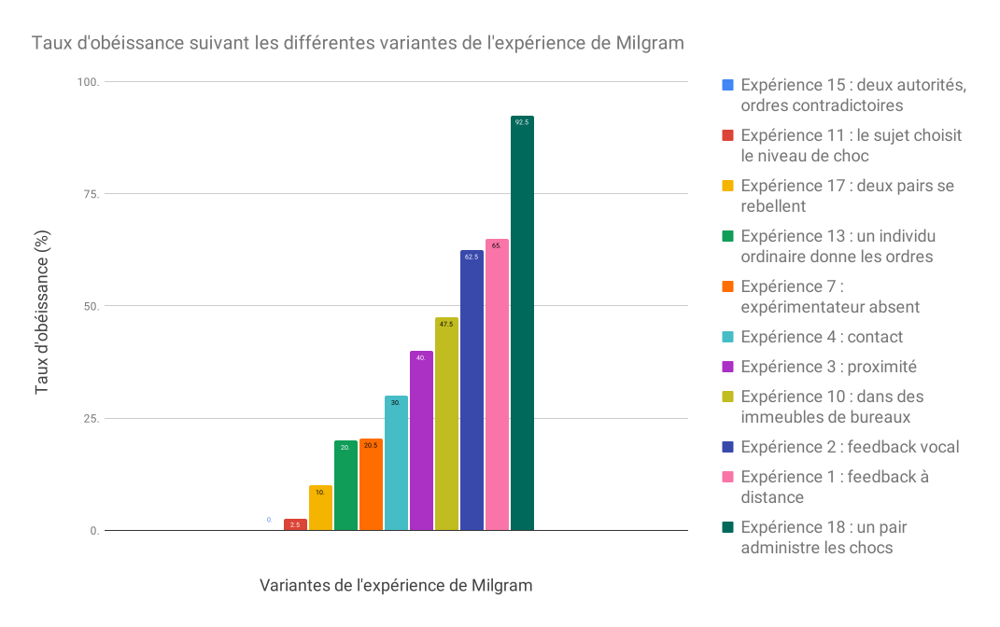
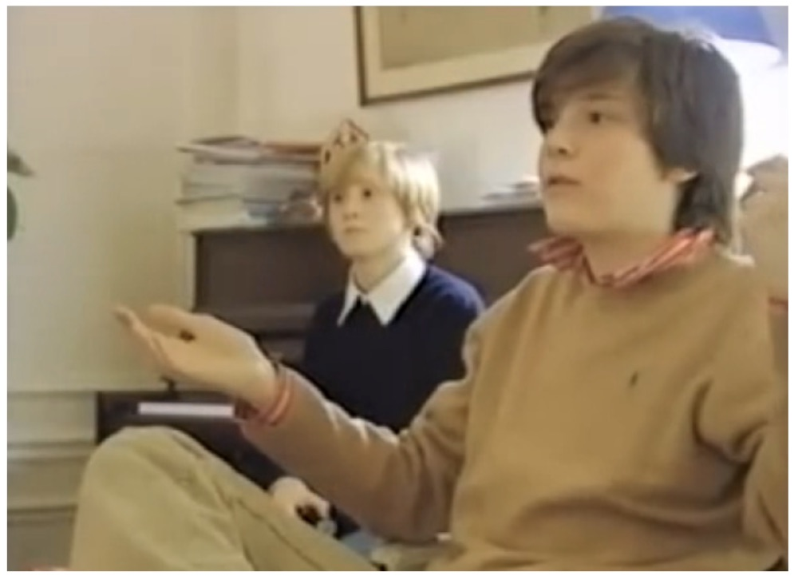
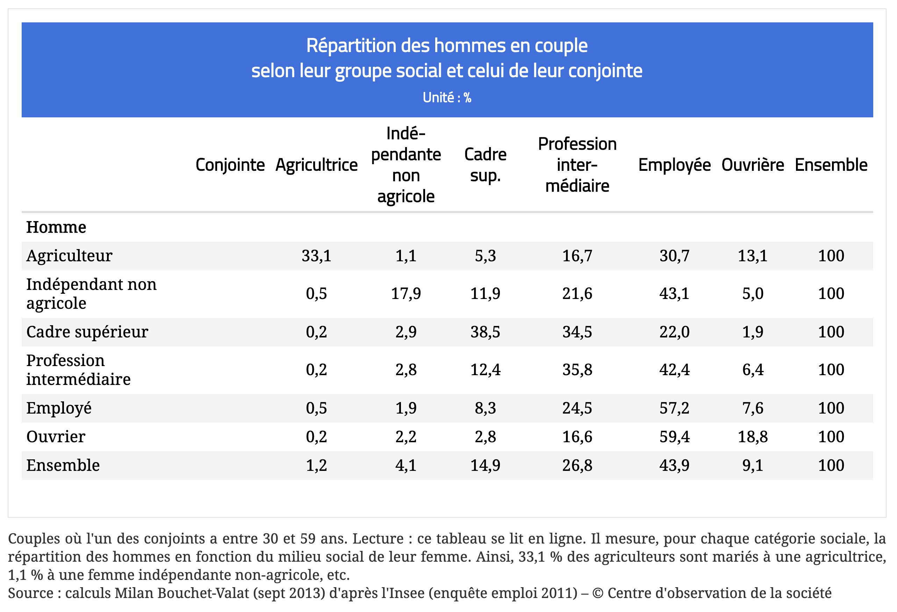

<!-- _class: titre -->

# Q2 –  Peut-on prouver l'inexistence du libre arbitre ?

Cédric Eyssette (2024-2025)
https://eyssette.forge.apps.education.fr/

---
<!-- _class: i1t0 -->

<!-- https://www.youtube.com/watch?v=QOZRim9SKm8 -->

---
<!-- _class: i1t1 vertical -->

L'expérience de Asch

---
<!-- _class: i2t1 pp-->

### L'expérience de Milgram

<!-- Faire rapprochement avec “Le jeu de la mort” -->

---
<!-- _class: i1t1 vertical pp -->

### Les variantes de l'expérience de Milgram <!-- fit -->

<!-- Faire un rappel sur l'empathie, le cours sur les morales du sentiment, l'idée de mise à distance d'autrui, la question de la “banalité du mal” -->

---
<!-- _class: partie -->
# I —  L'être humain est  déterminé par des  facteurs inconscients <!-- fit -->
Première partie

<!-- déterminé dans ce qu'il fait, ce qu'il pense, ce qu'il est -->

---
<!-- _class: definition -->
#### Définition
Le **déterminisme**, c'est l'idée qu'on peut expliquer un phénomène par les facteurs qui sont la cause de ce phénomène.

<!-- Le déterminisme s'applique-t-il à l'esprit humain ? -->

---
<!-- _class: i1t0 pp  -->

---
<!-- _class: citationC fppppppp  -->

> « La plupart de ceux qui ont parlé […] des conduites humaines paraissent traiter, non de choses naturelles qui suivent les lois ordinaires de la Nature, mais de choses qui seraient hors Nature. Mieux, on dirait qu’ils conçoivent l’homme dans la Nature comme un empire dans un empire »
>> **Spinoza**, _Éthique_, III, préface

---
<!-- _class: souspartie -->

## A. Un déterminisme  biologique ? <!-- fit -->
&rarr; Une question trop complexe,
trop technique pour être traitée ici.

<!-- Présenter autrement : mettre directement titre partie A.
Simplifier le titre "A. Les facteurs …"
faire partie A sur les facteurs biologiques

Les facteurs biologiques envisageables : les gènes, les hormones, les neurones
Cas examiné : les gènes
Partir de ce que les élèves connaissent de la génétique
La génétique des comportements
quelques modèles animaux
Les limites :
1) la complexité psychologique, sociale humaine => pas de transposition possible d'une espèce animale à l'être humain
2) la complexité génétique : on ne peut pas associer un comportement à l'expression mécanique d'un gène
Reste la question de l'influence de certains facteurs génétiques (sans identification précise, et sans fatalisme) sur l'augmentation de la probabilité d'apparition de certaines caractéristiques.
Attention aux raccourcis, aux simplifications. Prudence requise.
-->

---
<!-- _class: souspartie -->
## B. Un déterminisme  psychique ? <!-- fit -->

---
<!-- _class: citationC fmmmm -->

>«  Dans le cours des siècles, la science a infligé à l’égoïsme naïf de l’humanité deux graves démentis. La première fois, ce fut lorsqu’elle a montré que la terre, loin d’être le centre de l’univers, ne forme qu’une parcelle insignifiante du système cosmique dont nous pouvons à peine nous représenter la grandeur [...]. Le second démenti fut infligé à l’humanité par la recherche biologique, lorsqu’elle a réduit à rien les prétentions de l’homme à une place privilégiée dans l’ordre de la création, en établissant sa descendance du règne animal [...]. Un troisième démenti sera infligé à la mégalomanie humaine par la recherche psychologique de nos jours qui se propose de montrer au moi qu’il n’est seulement pas maître dans sa propre maison, qu’il en est réduit à se contenter de renseignements rares et fragmentaires sur ce qui se passe, en dehors de sa conscience, dans sa vie psychique. » 
>>**Freud**, *Introduction à la psychanalyse* (1916), II, chap. 18 

---
<!-- _class: fp -->

Freud prétend inscrire la psychologie dans l'histoire des grandes découvertes scientifiques

||||
|:-:|:-:|:-:|
Physique | Copernic | La Terre n'est pas  le centre du monde
Biologie | Darwin | L'être humain n'est pas  le centre de la vie sur Terre
Psychologie | Freud ! | La conscience n'est pas le centre de l'esprit humain

<!-- 
La Terre n'est pas le centre du monde :
Passage d'un univers fini avec un centre (la Terre : géocentrisme)
à un univers infini, sans centre

L'être humain n'est pas le centre de la vie sur Terre :
dépassement des anciennes classifications du vivant (hiérarchisation avec l'être humain au sommet) ; cf. le buisson du vivant au Musée des Confluences
https://planet-terre.ens-lyon.fr/ressource/Img492-2015-04-06.xml

 -->

---
<!-- _class: citationC  fpppppp-->

>«  Le moi n'est pas maître dans sa propre maison »
>>**Freud**

---
<!-- _class: i1t1 horizontal fppp -->

Le moi conscient ne représente que la surface de la vie psychique.
 Il faut explorer les profondeurs de l'esprit humain : il y a en nous un inconscient psychique qui constitue l'essentiel de ce que nous sommes.

<!-- Le moi conscient ne représente que la surface de la vie psychique.
Il faut explorer les profondeurs de l'esprit humain : 

Nous ne sommes pas transparents à nous-mêmes : il faut explorer les profondeurs de l'esprit humain pour nous comprendre. L'essentiel de notre vie psychique ne se trouve pas dans la conscience  -->

---
<!-- _class: fmmm -->

### L'inconscient selon Freud

1) Des motifs psychiques inconscients

>

||||
|:-:|:-:|:-:|
Le Moi | la salle de conférence | = les fonctions conscientes  (agir, parler, réfléchir …)
Le Ça | les personnes dehors  qui veulent rentrer  dans la salle | = les pulsions inconscientes  (pulsions sexuelles  et agressives)
Le Surmoi | un gardien qui  contrôle l'entrée | = le refoulement des pulsions  qui ne correspondent pas  aux normes sociales et à un idéal du moi que nous avons intériorisés

2) Une structuration psychique inconsciente, qui s'est constituée pendant l'enfance

---
<!-- _class: i1t1 vertical -->

Un film : _La tête haute_

---
<!-- _class: fpppp -->
#### Bilan
Les hypothèses spécifiques de Freud sont remises en causes, mais la psychologie contemporaine conserve généralement certaines idées :
1) l'absence de transparence à soi-même et l'importance de la verbalisation du vécu
2) l'importance de l'intersubjectivité pour se construire
3) l'importance de l'enfance dans la construction de soi

---
<!-- _class: souspartie -->
## B. Un déterminisme social ? <!-- fit -->

---
<!-- _class: citationC  -->

>« Ce n’est pas la conscience des hommes qui détermine leur existence, c’est au contraire leur existence sociale qui détermine leur conscience. »
>>Karl **Marx**, *Contribution à la critique de l’économie politique*, préface

<!-- 
La place de l'individu dans la société (les conditions de vie matérielles, le niveau économique de richesse) influence profondément nos pensées (croyances, valeurs, positions politiques), nos désirs et nos choix.

La conscience intérieure est déterminée par la réalité matérielle et sociale extérieure
 -->

---
<!-- _class: i1t1  vertical -->

Antoine Gallien, _Baisemains et mocassins_ (2005)

---
<!-- _class: i1t1  horizontal -->

Dans le film _L'esquive_, d'Abdelattif Kechiche, Un groupe d'adolescents d'une cité HLM répète, pour leur cours de français, un passage de la pièce _Le Jeu de l'amour et du hasard_ de Marivaux.

---
<!-- _class: i1t0 pp -->

<!-- homogamie sociale -->

---
<!-- _class: partie -->
# II – L'existence de  facteurs d'influence ne  prouve pas l'inexistence  du libre arbitre <!-- fit -->
Deuxième partie

---
<!-- _class: souspartie -->
## A. Le déterminisme est statistique

<!-- ici : déterminisme = hypothèses déterministes des sciences humaines -->

---
<!-- _class:  -->
Le déterminisme décrit des tendances générales, des probabilités, et des régularités au niveau d'un groupe d'individus en observant le passé et le présent.

Mais il ne permet pas de prédire l'avenir de manière rigide et inévitable pour un individu.

<!-- 
On peut penser qu'il y a des marges d'indétermination
de la contingence
-->

<!-- déterminisme au sens "faible"
≠ déterminisme au sens fort : absence de possibilités alternatives / un seul futur possible. Argument du démon de Laplace
-->

---
<!-- _class: souspartie -->
## B. Le déterminisme n'est pas un fatalisme

---
<!-- _class: i1t1 vertical -->

**L'histoire d'Œdipe**

---
<!-- _class: definition -->
#### Définition
- Le **fatalisme** suppose l'existence d'un destin face auquel nous sommes impuissants. C'est l'idée que **ce qui doit arriver arrivera**, quoi que l'on fasse.

---
<!-- _class: citationC f-->

>« [D]epuis que les sciences positives de la nature se sont constituées […], que de changements n'avons-nous pas introduits dans l'univers ! Il en sera de même dans le règne social. […] [C]'est la sociologie qui, en découvrant les lois de la réalité sociale, nous permettra de diriger avec plus de réflexion que par le passé l'évolution historique ; car nous ne pouvons changer la nature, morale ou physique, qu'en nous conformant à ses lois. […] Les sciences, en même temps qu'elles proclament la nécessité des choses, nous mettent entre les mains les moyens de la dominer. »
>>Émile **Durkheim**, _Sociologie et sciences sociales_

---
<!-- _class: -->

Si on peut expliquer les facteurs qui peuvent exercer une influence sur nous, alors on peut savoir comment agir sur ces facteurs pour les maîtriser.

---
<!-- _class: partie -->
# Mise en  pratique <!-- fit -->

---
<!-- _class: exercice application fmmmmm -->

### Exercice d'application

- Choisir un sujet ci-dessous :
	- Le libre arbitre est-il une illusion ?
	- Un être humain est-il responsable de tout ce qu'il fait ?
	- L’idée d’une liberté totale a-t-elle un sens ?
	- Sommes-nous déterminés par notre passé ?
  	- Les humains sont-ils des êtres à part dans la nature ?
  	- L'explication scientifique de l'être humain est-elle incompatible avec l'affirmation de la liberté humaine ?
  	- L'idée d'inconscient remet-elle en cause la liberté ?
  	- La conscience est-elle ce qui me rend libre ?
- Rédiger une sous-partie de dissertation (autour de 300 mots)  :warning:  il faut défendre une seule réponse, mobiliser le cours, et utiliser le modèle _ARES_