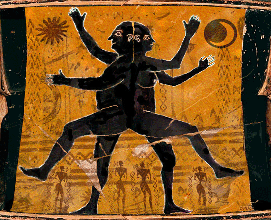
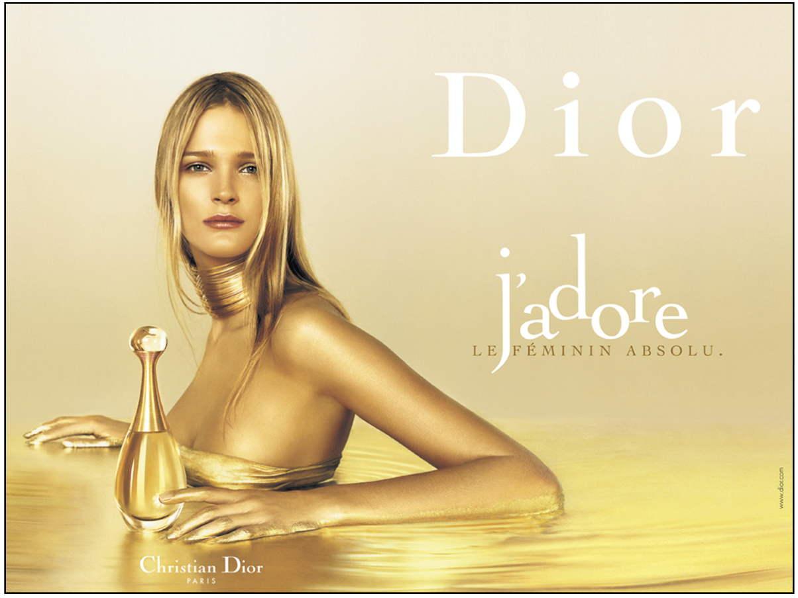

<!-- _class: titre -->

# Sommes-nous  esclaves de  nos désirs ? <!-- fit -->
Cédric Eyssette (2024-2025)
https://eyssette.forge.apps.education.fr/

---
<!-- _class: i1t1 vertical  pp -->

Steve Cutts, _Happiness_

<!-- 
Une norme sociale dominante : rats => effet de masse
Montage : toujours désirer autre chose
Présence massive de la publicité : (notamment référence au _Meilleur des mondes_ : “soma”)
Scène “Disney” : illusion, on retombe vite dans l'insatisfaction (chute)
piège à rat à la fin : coincés, prisonniers ?
Destination (au début) : nowhere
 -->

---
<!-- _class: i1t1 horizontal fppp -->

1) De quoi ce court métrage est-il la critique ?
2) Cette critique vous semble-t-elle correcte ? Vivons-nous vraiment comme ces rats ?
3) De manière générale, sommes-nous esclaves de nos désirs ? Peut-on maîtriser nos choix, nos décisions ?

<!--
Ce court métrage est une critique de la société de consommation, qui constitue une norme sociale dominante, dont le fondement repose sur l'incitation à l'achat de toujours plus de biens matériels et de services, par le biais principalement de la publicité.
Plusieurs questions se posent : 
1. Le désir d'avoir toujours plus est-il source de bonheur ou de souffrance ?
2. La consommation nous conduit-elle à une satisfaction profonde ou bien superficielle ?
… durable ou éphémère ?
… réelle ou illusoire ?
3. Sommes-nous prisonniers de ce modèle social ? Sommes-nous esclaves de nos désirs ?
 -->

---
<!-- _class: partie -->
# I – Critique de l’illusion de la liberté face aux désirs  <!-- fit -->
Première partie

---
<!-- _class: souspartie -->
## A. Le désir est un  manque qui crée  une tension en nous <!-- fit -->

---
<!-- _class: citationC -->

>« Tout vouloir naît du besoin, donc du manque, donc de la souffrance »
>>**Schopenhauer**, _Le Monde comme volonté et comme représentation_, Livre III, §38

<!--
1. Attention d'ordinaire on distingue : le désir, la volonté, le besoin, qui ne sont pas à confondre
2. Première analyse : le désir est un manque, car on désire ce qu'on n'a pas
Désirer quelque chose suppose que cette chose me manque pour que je sois pleinement heureux

Logique interne, implacable : donc … donc
-->

---
<!-- _class: i1t1 vertical  -->

Le mythe d'Aristophane

 <!-- https://www.youtube.com/watch?v=fmDpwXCyFOI -->

<!--
Éléments à retenir du mythe :
1. Au début de l'humanité, nous étions comme des sphères avec 2 têtes, 4 bras …
2. Zeus nous punit de notre orgueil et nous sépare en deux
3. Dès lors, nous sommes à la recherche de notre moitié.

Le désir amoureux = la quête d'une plénitude, d'une complétude
c'est la recherche d'une fusion avec une personne pour ne faire qu'un avec elle
(fusion psychique et physique : cf. )

Suite du mythe :
Cette recherche est incessante et la fusion n'est jamais absolue 

d'incomplétude.
Mais : 1/ On ne peut jamais avoir la certitude d'avoir trouvé notre “moitié”.
2/ La fusion est impossible : nous restons à jamais des individus séparés.
=> Le désir amoureux est une souffrance
 -->

---
<!-- _class: i1t0 pp -->

<!-- 
La publicité utilise plusieurs procédés pour donner aux individus l’envie d’acheter un produit ou un service.
Essayons d’analyser une publicité précise pour comprendre de manière plus concrète le mode de fonctionnement de la publicité.
Dans une publicité, tout est signifiant, tout a été conçu pour susciter en nous une envie d’acheter le produit ou le service proposé.
Il faut donc essayer de comprendre le sens de chaque élément et la manière dont ces éléments cherchent à créer en nous un désir.

- l'excitation des sens : la nudité, les cheveux, la bouteille effleurée devant la poitrine
=> envie “brute”
- perfection : signes du luxe et de la richesse (l'or : couleur, sonorités), de la distinction (Paris, absolu, la posture), de la beauté (retouches Photoshop pour correspondre à des "canons")
- mise en scène du désir pour l'objet : adore, l'objet touché
=> envie d'avoir (je n'ai pas ce qui est désirable, je n'ai pas ce que les autres désirent)
- transformation de l'individu grâce à l'objet : ambivalence du "Je" dans J'adore, Le féminin absolu, forme du parfum // femme (avoir le parfum : être comme cette femme) : mythe de Midas inversé (en touchant le parfum, je deviens quelqu'un d'autre : je me transforme)
=> envie d'être (je ne suis pas parfait·e)

Le faire sous forme de carte mentale :
La publicité Dior repose sur …
  - l'excitation des sens
    - la nudité, les cheveux, la bouteille effleurée devant la poitrine
  - la représentation d'un univers idéal :
    - signes du luxe et de la richesse (l'or : couleur, sonorités), de la distinction (Paris, absolu, la posture), de la beauté (retouches Photoshop pour correspondre à des "canons")
  - la mise en scène du désir pour l'objet :
    - j'adore, l'objet touché
  - la transformation de l'individu grâce à l'objet :
    - ambivalence du "Je" dans J'adore, Le féminin absolu, forme du parfum // femme (avoir le parfum : être comme cette femme) : mythe de Midas inversé (en touchant le parfum, je deviens quelqu'un d'autre : je me transforme)

Autres procédés possibles :
- valorisation du nouveau par rapport à l'ancien (désir d'avoir)
- affirmation d'une identité particulière ou identification à un groupe (désir d'être)

-->

---
<!-- _class: fmmm -->

Cette publicité repose sur … :

1) L'excitation des sens  &rarr; La nudité, les cheveux, le bain, le regard, la bouteille effleurée devant la poitrine
2) La représentation d'un univers idéal ou du moins supérieur  &rarr; L'or (signe de luxe, de richesse), une image retouchée sous Photoshop, le terme “_absolu_.”, les signes de distinction (“Paris”, “Dior”, la posture), la disposition dans l'espace : espace éthéré + verticalité + séparation marquée par le bras 
3) La mise en scène du désir pour l'objet (le désir mimétique)  &rarr; “J'adore”, l'objet touché par une mannequin
4) La prétendue transformation de l'individu grâce à l'objet  &rarr; L'ambivalence du “Je” dans “J'adore”, “_le féminin absolu_”, l'analogie entre la forme du parfum et le corps de la femme, la référence inversée au mythe de Midas

<!-- 
Analyse de différentes formes de manque :

- Manque ressenti directement dans le corps
- Manque par comparaison, produit par l'esprit
  - Comparaison avec un modèle idéal
  - Comparaison avec les autres

Plus profondément le désir n'est-il pas l'expression d'un manque d'être ?
Le désir : manque existentiel

-->

---
<!-- _class:  -->
### Exercice facultatif

1. Choisir dans un journal une image publicitaire, la découper et la coller sur une feuille
2. Faire l'analyse de cette image : comment cette image cherche-t-elle à susciter en nous un état de manque ?

---
<!-- _class: souspartie -->
## B. Nous désirons toujours plus

<!-- 
1ère étape : Le désir est frustration
2e étape : Cette frustration ne cesse pas, c'est un “supplice éternel”
Donc : le désir est une souffrance perpétuelle
 -->

---
<!-- _class: citationC fpppppppppp-->

>« [L]e sujet du vouloir […] remplit éternellement le tonneau des Danaïdes »
>>**Schopenhauer**, _Le Monde comme volonté et comme représentation_, Livre III, §38

---
<!-- _class: fppppppp -->

#### Le “sujet du vouloir”

À première vue : c'est la personne qui veut, qui a des préférences personnelles, et qui a l'impression d'exprimer son identité, ce qu'elle est, à travers ses choix.  &rArr; Nos désirs semblent exprimer notre **liberté**.

Mais en réalité, cela désigne la personne assujettie à ses désirs, **esclave** de ses désirs.

---
<!-- _class: i1t0 pp -->

---
<!-- _class: fmm pp -->

|Image|Signification|
|:-:|:-:|
|Le tonneau plein|Le bonheur comme  état de plénitude|
|Le vide dans le tonneau|Un état de manque en nous,  un état d'insatisfaction|
|Remplir le tonneau|Chercher à combler ce manque  en satisfaisant nos désirs|
|Le tonneau est percé|Nous désirons toujours plus (= la pléonexie)|
|Le tonneau se  vide rapidement|La satisfaction est temporaire :  nous retombons vite dans l'insatisfaction|
|Le tonneau ne sera  jamais plein|Nous ne parviendrons pas au bonheur|

<!-- Trois exemples :
1. La société de consommation (court métrage Happiness)
2. Fortnite
3. Snapchat -->

---
<!-- _class: i1t1 pp fpppppp-->

[Extrait 1](https://ladigitale.dev/digiview/#/v/66e40d51ed01d) : les techniques de rétention dans Fortnite  <!-- 
5 57 / 10 15
https://youtu.be/uUlJarbHrMU?t=493 -->

[Extrait 2](https://ladigitale.dev/digiview/#/v/66e40e099a850) : les réseaux sociaux et l'économie de l'attention 
<!--
39 14 / 42 51
https://youtu.be/uUlJarbHrMU?t=2353 -->

<!--
Extrait 1 : Noter au tableau les termes (en anglais) à définir
Qu'est-ce qui fait que les individus qui jouent à Fortnite vont avoir envie de rejouer ?

Extrait 2 : Qu'est-ce que l'économie de l'attention ?
Comment les entreprises procèdent-elles pour capter l'attention des individus ?

Le succès du jeu Fortnite provient en partie de l'utilisation de techniques de rétention qui cherchent à retenir les personnes qui jouent dans le jeu, et à leur donner envie de jouer toujours plus. Exemples : systèmes de mission, d'objectifs, de customisation du jeu, de variantes (random, campagnes …)

Fortnite s'inscrit dans une économie de l'attention où l'enjeu économique est de capter l'attention des individus, par le biais de techniques fondées sur la connaissance de la psychologie humaine.
Exemples :
L'auto-play -> tendance à en rester à l'option par défaut (= le biais de statu quo)
Les likes -> Besoin de reconnaissance sociale
 -->

---
<!-- _class: i1t0 -->

<!-- 
Sur quels principes psychologiques repose l'application Snapchat ?

Effet Ikea
Principe du don / contre-don
Désinhibition
Aversion à la perte
 -->
