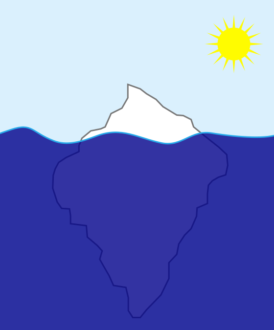
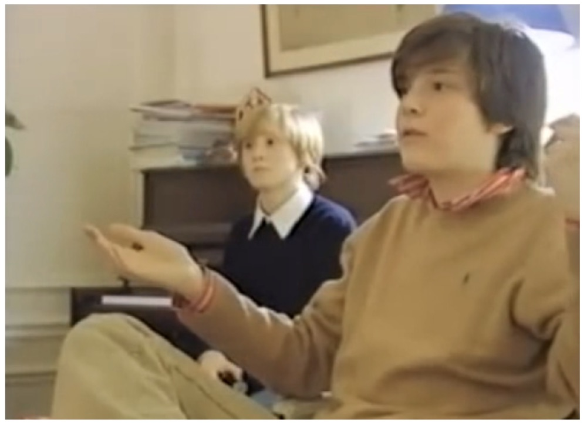

<!-- _class: titre -->

# Q1b – Nos choix sont-ils  déterminés par des  facteurs que nous ne maîtrisons pas ? <!-- fit -->

Cédric Eyssette (2024-2025)
https://eyssette.forge.apps.education.fr/

---
<!-- _class: i1t0 -->

<!-- https://www.youtube.com/watch?v=QOZRim9SKm8 -->

---
<!-- _class: partie -->
# I - Défense de  l'existence de facteurs qui nous  influencent <!-- fit -->
Première partie

---
<!-- _class: i1t0  -->

<!-- 
Ces androïdes ont-ils un libre arbitre ?
Y a-t-il une différence fondamentale entre ces androïdes et nous-mêmes ?
-->

---
<!-- _class: citationC -->

>« Telle est cette liberté humaine que tous les hommes se vantent d'avoir et qui consiste en cela seul que les hommes sont conscients de leurs désirs et ignorants des causes qui les déterminent ! »
>>**Spinoza**, _Lettre 58_ à Schuller

---
<!-- _class:  -->

Nous avons le sentiment d'être libre parce que nous croyons être la source de nos actes.

Mais s'il existe des facteurs inconscients qui déterminent nos actes, alors cette croyance est fausse.

Donc : le sentiment d'être libre ne prouve pas notre liberté.

---
<!-- _class: -->
- Quels sont les facteurs qui peuvent exercer une influence inconsciente sur nous ?

---
<!-- _class: souspartie -->
## A. Les facteurs  psychiques <!-- fit -->

---
<!-- _class: citationC fmmmmm -->

>«  Dans le cours des siècles, la science a infligé à l’égoïsme naïf de l’humanité deux graves démentis. La première fois, ce fut lorsqu’elle a montré que la terre, loin d’être le centre de l’univers, ne forme qu’une parcelle insignifiante du système cosmique dont nous pouvons à peine nous représenter la grandeur [...]. Le second démenti fut infligé à l’humanité par la recherche biologique, lorsqu’elle a réduit à rien les prétentions de l’homme à une place privilégiée dans l’ordre de la création, en établissant sa descendance du règne animal [...]. Un troisième démenti sera infligé à la mégalomanie humaine par la recherche psychologique de nos jours qui se propose de montrer au moi qu’il n’est seulement pas maître dans sa propre maison, qu’il en est réduit à se contenter de renseignements rares et fragmentaires sur ce qui se passe, en dehors de sa conscience, dans sa vie psychique. » 
>>**Freud**, *Introduction à la psychanalyse* (1916), II, chap. 18 

---
<!-- _class: fpp -->

Freud prétend inscrire la psychologie dans l'histoire des grandes découvertes scientifiques

||||
|:-:|:-:|:-:|
Physique | Copernic | La Terre n'est pas le centre du monde
Biologie | Darwin | L'être humain n'est pas le centre de la vie sur Terre
Psychologie | Freud ! | ……………… n'est pas le centre de ………………

La conscience

l'esprit humain

<!-- 
La Terre n'est pas le centre du monde :
Passage d'un univers fini avec un centre (la Terre : géocentrisme)
à un univers infini, sans centre

L'être humain n'est pas le centre de la vie sur Terre :
dépassement des anciennes classifications du vivant (hiérarchisation avec l'être humain au sommet) ; cf. le buisson du vivant au Musée des Confluences
https://planet-terre.ens-lyon.fr/ressource/Img492-2015-04-06.xml

 -->

---
<!-- _class: citationC -->

>«  Le moi n'est pas maître dans sa propre maison »
>>**Freud**

---
<!-- _class: i1t1 horizontal f -->

Le moi conscient ne représente que la surface de la vie psychique.
 Il faut explorer les profondeurs de l'esprit humain : il y a en nous un inconscient psychique qui constitue l'essentiel de ce que nous sommes

<!-- Le moi conscient ne représente que la surface de la vie psychique.
Il faut explorer les profondeurs de l'esprit humain : 

Nous ne sommes pas transparents à nous-mêmes : il faut explorer les profondeurs de l'esprit humain pour nous comprendre. L'essentiel de notre vie psychique   -->

---
<!-- _class: i1t1 vertical -->

Un film : _La tête haute_

---
<!-- _class: souspartie -->
## B. Les facteurs sociaux <!-- fit -->

---
<!-- _class: citationC  -->

>« Ce n’est pas la conscience des hommes qui détermine leur existence, c’est au contraire leur existence sociale qui détermine leur conscience. »
>>Karl **Marx**, *Contribution à la critique de l’économie politique*, préface

---
<!-- _class: i1t1  vertical -->

Antoine Gallien, _Baisemains et mocassins_ (2005)

---
<!-- _class: i1t1  horizontal -->

Dans le film _L'esquive_, d'Abdelattif Kechiche, Un groupe d'adolescents d'une cité HLM répète, pour leur cours de français, un passage de la pièce _Le Jeu de l'amour et du hasard_ de Marivaux.

---
<!-- _class: i1t0 pp -->

---
<!-- _class: partie -->
# II -  Défense d'une certaine  autonomie face aux  facteurs d'influence <!-- fit -->
Première partie

---
<!-- _class: citationC fp-->

>« Pour établir la preuve de la liberté, considérons d’abord que certains êtres agissent sans aucun jugement, comme la pierre qui tombe vers le bas […] D’autres êtres agissent d’après un certain jugement, mais qui n’est pas libre. Ainsi les animaux telle la brebis qui, voyant le loup, juge qu’il faut le fuir […] par un instinct naturel. […] Mais l’homme agit d'après […] un rapprochement de données opéré par la raison. »
>>**Thomas d'Aquin**, _Somme théologique_, I, question 83, réponse

---
<!-- _class: i1t1 pp -->

Exemple 1 : le roulement des œufs chez l'oie cendrée

---
<!-- _class: i1t1 pp -->

Exemple 2 : l'agressivité de l’épinoche

---
<!-- _class: exercice tableau colonnes fmm-->

|Agir par instinct|Agir après réflexion|
|:-:|:-:|
|?|?|
|?|?|
|?|?|

1. Point de départ : une situation qui est analysée et examinée
2. Conséquence : un comportement flexible et inventif …
3. Point de départ : un stimulus qui déclenche immédiatement une réaction
4. Conséquence : un mécanisme rigide et automatique … 
5. … qui est toujours le même pour tous les individus de la même espèce
6. … qui peut être différent selon l'individu et la situation

---
<!-- _class: exercice tableau-r fm-->

|Agir par instinct|Agir après réflexion|
|:-:|:-:|
|_3_ Point de départ : un stimulus qui déclenche immédiatement une réaction|_1_ Point de départ : une situation qui est analysée et examinée|
|_4_ Conséquence : un mécanisme rigide et automatique … |_2_ Conséquence : un comportement flexible et inventif …|
|_5_… qui est toujours le même pour tous les individus de la même espèce|_6_ … qui peut être différent selon l'individu et la situation|

---
<!-- _class: i1t0 -->

---
<!-- _class: citationC f-->

>« [C]’est pourquoi l’homme agit selon un jugement libre, car il a la faculté de se porter à divers objets. En effet, dans le domaine du contingent, la raison peut suivre des directions opposées […]. Or, les actions particulières sont contingentes ; par suite le jugement rationnel qui porte sur elles peut aller dans un sens ou dans l’autre, et n’est pas déterminé à une seule chose. En conséquence, il est nécessaire que l’homme ait le libre arbitre, par le fait même qu’il est doué de raison. »
>>**Thomas d'Aquin**, _Somme théologique_, I, question 83, réponse

---
<!-- _class: definition fppppppppp -->

### Définition

Ce qui est **nécessaire**, c'est ce qui ne peut pas être autrement, c'est ce dont le contraire est impossible. Ce qui est **contingent**, c'est ce qui pourrait être autrement, c'est ce dont le contraire est possible.

---
<!-- _class:  -->
Si nos choix étaient totalement déterminés, ils suivraient un chemin fixe, sans possibilité de déviation.

L'idée de contingence signifie que plusieurs options sont ouvertes : nous sommes capable de décider, et cette décision engage notre responsabilité.