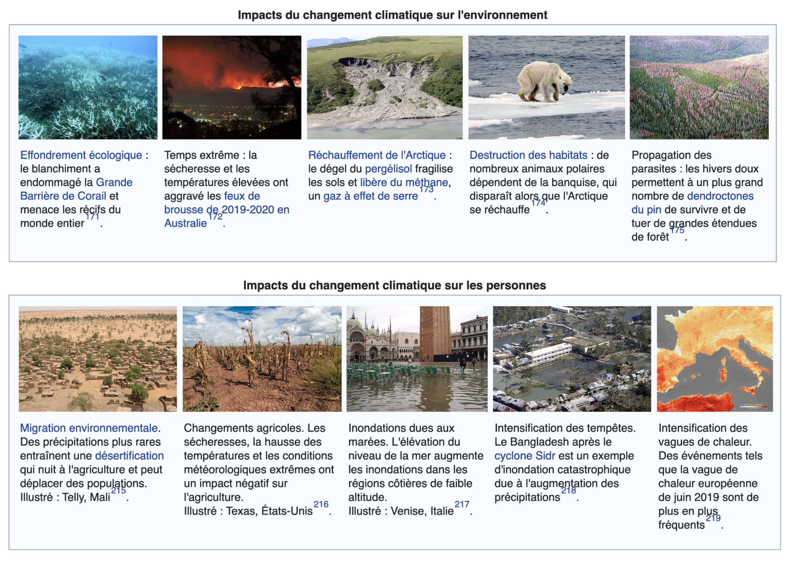

<!-- _class: titre -->

# Q2 : Y a-t-il des  limites morales  à la liberté ? <!-- fit -->
Cédric Eyssette (2024-2025)
https://eyssette.forge.apps.education.fr/

---
<!-- _class: colonnes pm -->

#### Discussion sur des cas d’éthique appliquée <!-- fit -->

- La prostitution
- La pornographie
- La fidélité en amour
- Les drogues
- L’avortement
- L’usage des biotechnologies (dopage, modifications génétiques) pour améliorer  l’être humain
- La gestation pour autrui (les mères porteuses)
- Le mariage homosexuel
- L’adoption d’un enfant par un couple homosexuel
- Le clonage
- L’euthanasie
- La peine de mort
- La guerre
- L’usage de la violence pour s’opposer à une loi
- La torture
- Les inégalités économiques et sociales
- L’aide humanitaire
- L'environnement, la nature
- Les migrations
- La consommation de viande
- La corrida
- Les expériences scientifiques sur les animaux

<!--
Noter les thèmes qui vous ont le plus intéressé

Si le temps : choisir un thème sur lequel il y a eu débat ; défendre à l'écrit votre position (au moins 1 argument précis) ; trouver dans la classe un élève qui n'est pas d'accord avec vous : cet élève devra vous répondre à l'écrit et expliquer les raisons de son désaccord -->

---
<!-- _class: pointmethode -->
### Point méthode
Il est important de donner un sens concret à la question posée. Il faut chercher à la rapporter à des enjeux réels.

---
<!-- _class: partie -->
# I – Il semble difficile  d'établir des limites  morales claires <!-- fit -->
Première partie

---
<!-- _class: souspartie -->
## A. Un jugement moral est  un jugement de valeur,  et non un jugement de fait <!-- fit -->

---
<!-- _class: fppp -->

|Jugement de fait|Jugement de valeur|
|:-:|:-:|
|Décrit ou  explique le monde  tel qu'il est|Exprime ce qui doit  être, ou ce qui  devrait être|
|Prétend n'être qu'un  constat neutre et  objectif de la réalité|Implique une évaluation  en fonction d'une  norme ou d'un idéal|

* Un jugement de valeur semble être une appréciation subjective

<!-- Donner quelques exemples de jugement à l'oral : à classer -->

---
<!-- _class: souspartie -->
## B. Chaque culture  a son code moral

---
<!-- _class: citationC fppppppppp-->

>« [D]ès notre naissance, l’entourage fait pénétrer en nous, par mille démarches conscientes et inconscientes, un système complexe de références consistant en jugements de valeur, motivations, centres d’intérêt […]. »
>>Claude **Lévi-Strauss**, _Race et histoire_

---
<!-- _class: fpppppp -->

Chaque société transmet des valeurs et des normes :

&bull; de manière consciente, par _inculcation_ (c'est dit de manière explicite)

&bull; de manière inconsciente, par _imprégnation_ (cela reste implicite)

---
<!-- _class:  -->

Nous avons ainsi tendance à penser le bien et le mal d'après ce code moral qui a façonné nos croyances.

C'est une forme d'**ethnocentrisme**.

---
<!-- _class: definition -->
### Définition
**L'ethnocentrisme** désigne le fait de percevoir les choses à travers le filtre de notre propre culture

---
<!-- _class: citationC fp -->

>« [C]hacun appelle barbarie ce qui ne fait pas partie de ses usages. Car il est vrai que nous n’avons pas d’autres critères pour la vérité et la raison que les exemples que nous observons et les idées et les usages qui ont cours dans le pays où nous vivons. C’est là que se trouve, pensons-nous, la religion parfaite, le gouvernement parfait, l’usage parfait et incomparable pour toutes choses. »
>>**Montaigne**, _Essais_, I, 30

---
<!-- _class: citationC fm -->

>« Un jour Darius, ayant appelé près de lui des Grecs […] leur demanda pour quelle somme ils pourraient se résoudre à se nourrir des corps morts de leurs pères. Tous répondirent qu'ils ne le feraient jamais, quelque argent qu'on pût leur donner. Il fit venir ensuite les Calaties, peuples des Indes, qui mangent leurs pères ; il leur demanda […] quelle somme d'argent pourrait les engager à brûler leurs pères après leur mort. Les Indiens, se récriant à cette question, le prièrent de ne leur pas tenir un langage si odieux : tant la coutume a de force. »
>>**Hérodote**, Histoire, III, 38

<!-- Exemple de l'endocannibalisme funéraire
“manger ses morts” : peut être une marque de respect !
 -->

---
<!-- _class: partie -->
# II – Les limites morales  ne sont pas relatives :  nous avons des  devoirs moraux <!-- fit -->
Deuxième partie

---
<!-- _class: definition fppppppp -->
#### Définition
- Le **relativisme moral**, c'est l'idée que la morale est relative au point de vue de l'individu et de sa culture.
- Il n'y aurait pas de vérité universelle à propos du bien et du mal.

---
<!-- _class: souspartie -->
## A. Le relativisme  conduirait à accepter des pratiques intolérables <!-- fit -->

---
<!-- _class: i1t1 vertical pp fp -->

**Exemple 1 :** Les chats brûlés lors des feux de la St-Jean

<!-- garder seulement les 2 autres exemples pour l'année prochaine ? -->

---
<!-- _class: i1t1 vertical pp fp -->

**Exemple 2 :** Les hyènes du Malawi

<!-- 
Reportage complet :
https://www.youtube.com/watch?v=YYxb90Musk8

Dans certaines communautés du Malawi, malgré l’interdiction légale depuis 2003, subsiste encore un rituel de purification sexuelle (kusasa fumbi) : dès les premières règles d'une jeune fille, lors du décès d’un conjoint, ou pour construire une nouvelle maison, les familles malawites font appel à une “hyène” (un fisi). Ils paient un homme, dont c'est officieusement le “métier”, pour “purifier” le corps de leur fille ou de la femme par une relation sexuelle non consentie ni protégée.

 -->

---
<!-- _class: i1t1 vertical pp fp -->

**Exemple 3 :** Les mutilations génitales féminines (l'excision)

---
<!-- _class: souspartie -->
## B. Les jugements moraux  ne sont pas des jugements  de préférence subjectifs <!-- fit -->

---
<!-- _class: i1t0  -->

1) 
2) 

<!-- Le dégoût ressenti face à l'idée de manger une tarentule frite ≠ le dégoût ressenti face à des actes de pédophilie -->

---
<!-- _class: i1t0 -->

<!-- Gaebul ou “pénis de mer” -->

---
<!-- _class: -->

Un jugement de préférence exprime un simple goût personnel.

Un jugement de valeur prétend exprimer une vérité et on peut chercher à justifier ou critiquer ce jugement.

---
<!-- _class:  -->
Certes, on ne peut pas prétendre avoir démontré la vérité d'un jugement de valeur.

Mais on peut objectivement évaluer certains raisonnements moraux.

---
<!-- _class: pointmethode fppp -->

### Point méthode

Il y a **deux stratégies** pour critiquer un raisonnement :
1) La stratégie **“Ah bon ?”** : on remet en cause la vérité ou la cohérence d'un des points de départ du raisonnement.
2) La stratégie **“Et alors ?”** : on montre que même si le point de départ est vrai, cela ne justifie pas la conclusion.

---
<!-- _class: fppp -->
### Exemples de raisonnements incorrects

Pour justifier la consommation de viande, on entend parfois ce type d'arguments :

1) La viande, mmm... c'est super bon !
2) Les animaux qu'on mange ne souffrent pas !
3) On s'en fiche : ce ne sont que des animaux !
4) Tout le monde le fait !
5) Les êtres humains ont toujours chassé et pêché !
6) C'est la loi du plus fort !

---
<!-- _class: souspartie -->
## C. La réflexion nous permet de mieux déterminer les limites  morales de notre liberté <!-- fit -->

---
<!-- _class: fpppp -->

La morale ne consiste pas à suivre une <mark>**autorité**</mark> extérieure qui me dit ce que je dois faire. On peut **réfléchir par soi-même** pour saisir notre devoir moral. Le devoir moral est une expression de notre <mark>**autonomie**</mark>.

Les limites morales de notre liberté ne sont pas des **<mark>contraintes</mark> extérieures**, mais des **<mark>obligations</mark> intérieures**.

---
<!-- _class: etape -->
### 1/ Il faut réfléchir aux  conséquences de nos actes<!-- fit -->

---
<!-- _class: definition fp -->
#### Définition
* L'**utilitarisme** soutient que les conséquences de nos choix doivent être les plus utiles possibles pour le plus grand nombre.
* But visé : un minimum de souffrances et un maximum de bonheur.
* Moyen : faire un calcul des conséquences le plus objectif et le plus global possible

---
<!-- _class: i1t1 pp vertical -->

Calcul objectif : exemple de l'homoparentalité

---
<!-- _class: i1t1 pp vertical-->

Calcul global: exemple du changement climatique

---
<!-- _class: etape -->
### 2/ Il faut réfléchir à ce que les  autres représentent pour nous<!-- fit -->

---
<!-- _class: fppppppp -->
**Autrui**
≠ simple moyen
≠ un objet que je peux utiliser comme je le souhaite
≠ un obstacle dont je peux me débarrasser si ça m'arrange
≠ un simple paramètre que je peux négliger

**Autrui**
= une personne, qui a une volonté, une autonomie, une dignité que je dois respecter

---
<!-- _class: fppppp -->
Les autres ne sont pas des êtres inférieurs à moi.

Je dois moralement considérer les autres comme ayant un statut égal et je ne peux pas m'accorder un droit d'exception par rapport aux autres.

Je dois pouvoir me mettre à la place d'autrui.

Cela ressemble au principe : “Ne fais pas à autrui ce que tu ne voudrais pas qu'il te fasse”.

---
<!-- _class: i1t0-->

<!-- Dans le film _Le Loup de Wall-Street_, Jordan Belfort, un trader, téléphone à des personnes peu aisées qui veulent placer leurs maigres économies, et leur ment sur la valeur des actions qu'il leur propose (« _I was selling them shit_ »). Ces personnes ne sont pour lui qu'un simple moyen de gagner plus d'argent : il les méprise et les considére comme de vulgaires bouseux. Vers la fin du film, quand sa femme lui annonce qu'elle veut divorcer, il ne la voit plus que comme un obstacle entre lui et ses enfants qu'il veut garder avec lui. Il devient violent jusqu'à la frapper dans l'estomac.
-->

---
<!-- _class: exercice application fmmmmmm -->

### Exercice d'application

- Choisir un sujet ci-dessous :
    - La liberté exclut-elle toute limite ?
    - La liberté d'expression doit-elle être absolue ?
    - La conscience morale n’est-elle que le résultat de l’éducation ?
    - Avons-nous des devoirs envers les animaux ?
    - La morale peut-elle se passer d’un fondement religieux ?
    - En morale, y a-t-il des certitudes ?
    - Le progrès technique peut-il conduire à de nouveaux problèmes moraux ?
- Rédiger une sous-partie de dissertation (±300 mots) :  :warning: il faut défendre une seule réponse, mobiliser le cours et utiliser le modèle ARES

